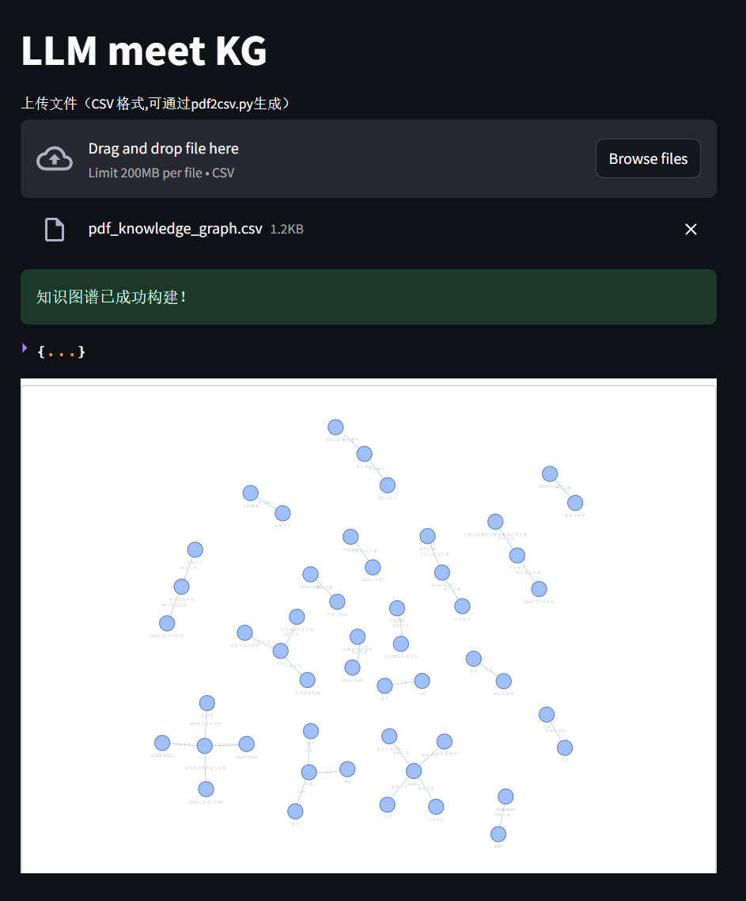
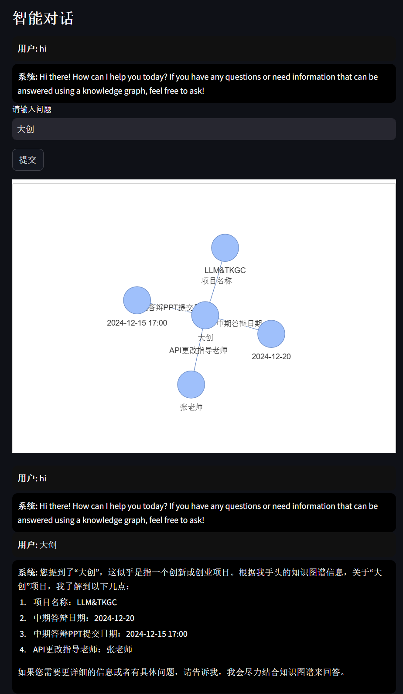
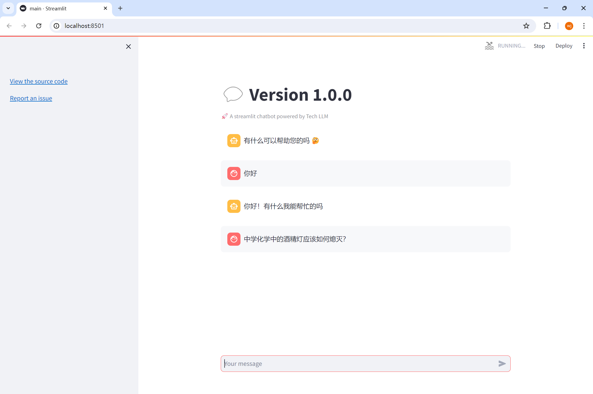
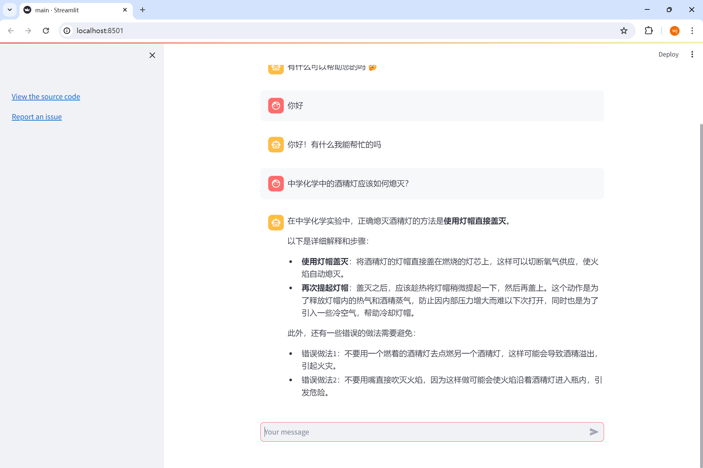

# 面向中小学科学教育大模型的领域知识增强方法研究与实现

## 项目背景

随着生成式人工智能的快速发展，越来越多的场景可以使用生成式模型来解决一系列问题或者大幅提升效率。然而，由于当前大模型的训练语料库规模虽大，但垂直性较低，因此在解决特定领域的问题时依然显得能力不足。为了解决大语言模型的这一缺陷，可以引入知识图谱（KG）来丰富大模型的推理语料，进而增强大模型的能力。

## 项目简介

本项目的 **理论指导** 依托于南京师范大学智能科学与教育研究院，在南京师范大学大学生创新训练计划中立项等级为 **省级**。项目名称为：面向中小学科学教育大模型的领域知识增强方法研究与实现。

本项目的 **训练数据** 依托于江苏凤凰教育出版社等权威语料库。通过构建完善的知识图谱、研发强大的检索引擎来提升大语言模型在中小学科学教育领域的垂直推理与应答能力。

本项目的 **项目成员** 如下：
- 队长：南京师范大学 22 级本科生 时子延 :email: [szy@nnu.edu.cn](mailto:szy@nnu.edu.cn)
- 成员：南京师范大学 22 级本科生 董文杰 :email: [explorer-dong@foxmail.com](mailto:explorer-dong@foxmail.com)
- 成员：南京师范大学 22 级本科生 马艺轩

## 项目成果

v2.0前端展示

构建知识图谱

检索增强结果

v1.0前端展示

询问中

响应结果

